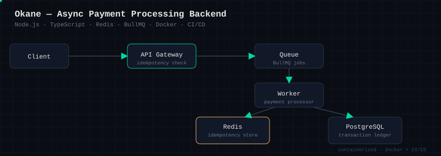
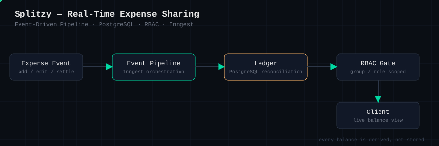
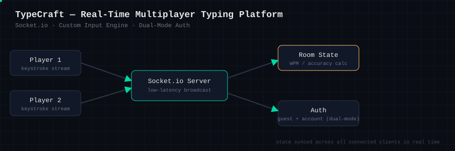

<div align="center">





[](https://leetcode.com/)
[](https://github.com/Syl3r27)

</div>

<br/>

### `> whoami`

- 🎓 3rd-year B.E. Computer Science (AI/ML) @ Rungta College of Engineering and Technology, Bhilai
- 🛠️ Backend-focused full-stack developer — I care more about what happens when a request fails than when it succeeds
- 🔍 Actively looking for **Software Engineering Internships**
- 🧩 Competitive programmer — 350+ problems solved, contest rating ~1620

<br/>

### `> ./run_projects.sh`

Each project below is diagrammed the way I'd actually explain it in an interview — components, data flow, and the failure mode I designed around.

<details open>
<summary><b>💸 Okane — Async Payment Processing Backend</b></summary>
<br/>



`Node.js` `TypeScript` `Redis` `BullMQ` `Docker` `CI/CD`

Built around the failure modes real payment systems hit: duplicate charges, dropped jobs, half-finished writes.
- **Idempotency** — Redis-backed keys stop a retried request from double-charging
- **Durability** — BullMQ queues decouple the API from processing, so a slow worker never blocks a client
- **Reproducibility** — fully containerized, with CI/CD running the same pipeline every time

</details>

<details open>
<summary><b>🧾 Splitzy — Real-Time Expense Sharing</b></summary>
<br/>



`PostgreSQL` `Inngest` `RBAC` `Event-Driven`

Every balance is **derived**, not stored — so the ledger stays correct even when events arrive out of order.
- Event-driven pipeline via Inngest handles add/edit/settle as discrete events
- PostgreSQL ledger with reconciliation logic keeps historical accuracy
- RBAC scopes who can see or modify a given group's expenses

</details>

<details open>
<summary><b>⌨️ TypeCraft — Real-Time Multiplayer Typing Platform</b></summary>
<br/>



`Socket.io` `Custom Input Engine` `Dual-Mode Auth`

- Socket.io keeps every player's screen in sync with sub-second broadcast latency
- A custom input-handling architecture drives accurate WPM/accuracy calculation
- Dual-mode auth lets people race as a guest or a full account, same room logic either way

</details>

<br/>

### `> cat tech_stack.txt`

<div align="center">


</div>

<br/>

### `> stats --all`

<div align="center">


</div>

<br/>

### `> git log --graph`

<div align="center">

<sub>Animates automatically via the included GitHub Action — see setup note below.</sub>
</div>

<br/>

### `> whats_next --status`

```text
🔭 Building:      Okane, Splitzy & TypeCraft — polishing for internship interviews
🌱 Sharpening:    DSA/CP (350+ LeetCode, rating ~1620)
🎯 Looking for:   Software Engineering Internships (Backend / Full-Stack)
💬 Ask me about:  Payment idempotency, event-driven ledgers, real-time sync
```

<br/>

### `> contact --all`

<div align="center">

[](https://linkedin.com/in/YOUR-LINKEDIN)
[](https://github.com/Syl3r27)
[](https://leetcode.com/YOUR-LEETCODE)
[](mailto:YOUR-EMAIL)

</div>

